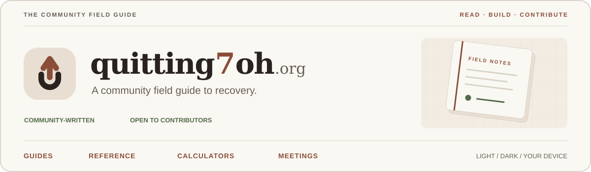
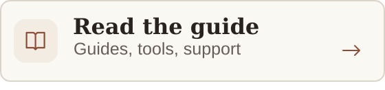
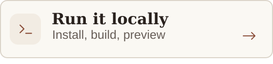
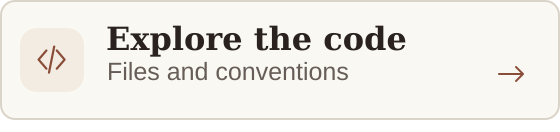
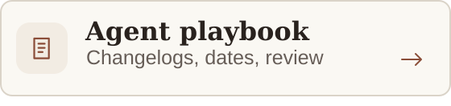
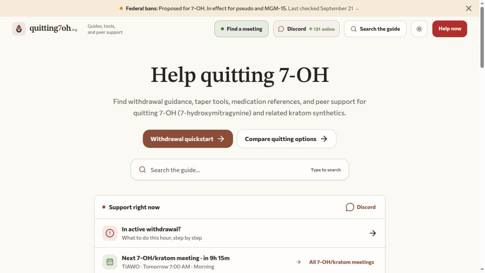
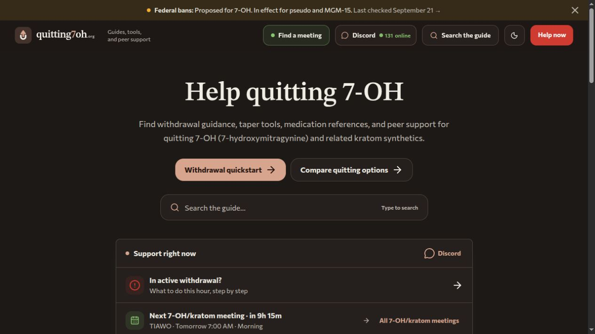
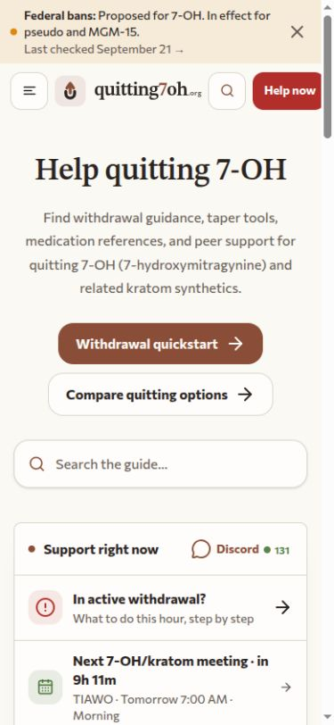
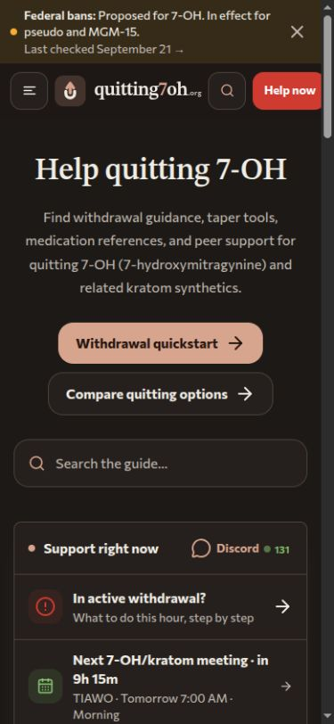

<p align="center">
  <picture>
    <source media="(prefers-color-scheme: dark)" srcset="docs/assets/readme-banner-dark.svg">
    
  </picture>
</p>

<h1 align="center">quitting7oh.org</h1>

<p align="center">
  A community-written reference for people coming off 7-OH and kratom-derived synthetics,<br>
  and for the people supporting them. Recovery guides, compound references,<br>
  taper calculators, and meeting finders share one searchable site.
</p>

<p align="center">
  <a href="https://quitting7oh.org"><strong>Visit the site ↗</strong></a> ·
  <a href="#quick-start">Quick start</a> ·
  <a href="#contributing">Contribute</a> ·
  <a href="CHANGELOG.md">Changelog</a>
</p>

<p align="center">
  <a href="https://github.com/quitting7oh/quitting7oh.org/actions/workflows/docker-publish.yml" target="_blank" rel="noopener noreferrer">
    <picture>
      <source media="(prefers-color-scheme: dark)" srcset="https://img.shields.io/github/actions/workflow/status/quitting7oh/quitting7oh.org/docker-publish.yml?branch=main&amp;style=flat-square&amp;label=build%20%26%20image&amp;labelColor=332b25">
      
    </picture>
  </a>
  <a href="https://github.com/quitting7oh/quitting7oh.org/actions/workflows/refresh-na-meetings.yml" target="_blank" rel="noopener noreferrer">
    <picture>
      <source media="(prefers-color-scheme: dark)" srcset="https://img.shields.io/github/actions/workflow/status/quitting7oh/quitting7oh.org/refresh-na-meetings.yml?branch=main&amp;style=flat-square&amp;label=NA%20meetings&amp;labelColor=332b25">
      
    </picture>
  </a>
  <a href="https://github.com/quitting7oh/quitting7oh.org/actions/workflows/update-ban-status.yml" target="_blank" rel="noopener noreferrer">
    <picture>
      <source media="(prefers-color-scheme: dark)" srcset="https://img.shields.io/github/actions/workflow/status/quitting7oh/quitting7oh.org/update-ban-status.yml?branch=main&amp;style=flat-square&amp;label=ban%20status&amp;labelColor=332b25">
      
    </picture>
  </a>
</p>

<p align="center">
  <a href="https://astro.build/" target="_blank" rel="noopener noreferrer">
    <picture>
      <source media="(prefers-color-scheme: dark)" srcset="https://img.shields.io/badge/Astro-BC522E?style=for-the-badge&amp;logo=astro&amp;logoColor=white&amp;labelColor=332b25">
      
    </picture>
  </a>
  <a href="https://react.dev/" target="_blank" rel="noopener noreferrer">
    <picture>
      <source media="(prefers-color-scheme: dark)" srcset="https://img.shields.io/badge/React-326E85?style=for-the-badge&amp;logo=react&amp;logoColor=white&amp;labelColor=332b25">
      
    </picture>
  </a>
  <a href="https://www.typescriptlang.org/" target="_blank" rel="noopener noreferrer">
    <picture>
      <source media="(prefers-color-scheme: dark)" srcset="https://img.shields.io/badge/TypeScript-3178C6?style=for-the-badge&amp;logo=typescript&amp;logoColor=white&amp;labelColor=332b25">
      
    </picture>
  </a>
  <a href="https://tailwindcss.com/" target="_blank" rel="noopener noreferrer">
    <picture>
      <source media="(prefers-color-scheme: dark)" srcset="https://img.shields.io/badge/Tailwind_CSS-287F8F?style=for-the-badge&amp;logo=tailwindcss&amp;logoColor=white&amp;labelColor=332b25">
      
    </picture>
  </a>
  <a href="https://lucaong.github.io/minisearch/" target="_blank" rel="noopener noreferrer">
    <picture>
      <source media="(prefers-color-scheme: dark)" srcset="docs/assets/badge-minisearch-dark.svg">
      
    </picture>
  </a>
</p>

<p align="center">
  <a href="https://github.com/quitting7oh/quitting7oh.org/commits/main" target="_blank" rel="noopener noreferrer">
    <picture>
      <source media="(prefers-color-scheme: dark)" srcset="https://img.shields.io/github/last-commit/quitting7oh/quitting7oh.org/main?style=flat-square&amp;color=8a4d38&amp;labelColor=332b25">
      
    </picture>
  </a>
  <a href="https://github.com/quitting7oh/quitting7oh.org/graphs/contributors" target="_blank" rel="noopener noreferrer">
    <picture>
      <source media="(prefers-color-scheme: dark)" srcset="https://img.shields.io/github/contributors/quitting7oh/quitting7oh.org?style=flat-square&amp;color=607448&amp;labelColor=332b25">
      
    </picture>
  </a>
  <a href="https://github.com/quitting7oh/quitting7oh.org/issues" target="_blank" rel="noopener noreferrer">
    <picture>
      <source media="(prefers-color-scheme: dark)" srcset="https://img.shields.io/github/issues/quitting7oh/quitting7oh.org?style=flat-square&amp;color=84704a&amp;labelColor=332b25">
      
    </picture>
  </a>
</p>

<p align="center">
  <a href="https://quitting7oh.org" target="_blank" rel="noopener noreferrer">
  <picture>
    <source media="(prefers-color-scheme: dark)" srcset="docs/assets/nav-read-dark.svg">
    
  </picture>
  </a>
  <a href="#quick-start">
  <picture>
    <source media="(prefers-color-scheme: dark)" srcset="docs/assets/nav-start-dark.svg">
    
  </picture>
  </a>
  <br>
  <a href="#code-map">
  <picture>
    <source media="(prefers-color-scheme: dark)" srcset="docs/assets/nav-code-dark.svg">
    
  </picture>
  </a>
  <a href="#agent-policy">
  <picture>
    <source media="(prefers-color-scheme: dark)" srcset="docs/assets/nav-agents-dark.svg">
    
  </picture>
  </a>
</p>

## A look inside

<table>
  <tr><th>Desktop · Light</th><th>Desktop · Dark</th></tr>
  <tr>
    <td width="50%"><a href="docs/assets/site-desktop-light.jpg"></a></td>
    <td width="50%"><a href="docs/assets/site-desktop-dark.jpg"></a></td>
  </tr>
</table>

<details>
<summary><strong>On your phone</strong> · Light and dark previews</summary>

<table>
  <tr><th>Mobile · Light</th><th>Mobile · Dark</th></tr>
  <tr>
    <td width="50%" align="center"><a href="docs/assets/site-mobile-light.jpg"></a></td>
    <td width="50%" align="center"><a href="docs/assets/site-mobile-dark.jpg"></a></td>
  </tr>
</table>

</details>

Screenshots show the site in both themes. Click a preview to see the full image;
meeting times and online counts reflect the capture, not a live feed.

<details>
<summary><strong>Find your way around this repository</strong></summary>

| Build and explore | Contribute and maintain |
| --- | --- |
| [Quick start](#quick-start) | [Contributing](#contributing) |
| [Code map](#code-map) | [Changelog rules](#changelog-updates) |
| [Conventions](#conventions) | [Page dates](#page-dates) |
| [Commands and checks](#commands-and-checks) | [Agent policy](#agent-policy) |

</details>

## The site

| Area | Included |
| --- | --- |
| Recovery guides | Withdrawal planning, medication information, post-acute recovery, and guides for family and friends. |
| Reference library | Compound profiles, pharmacology, source links, and dated content updates. |
| Interactive tools | Taper schedules, a SOWS symptom calculator, meeting times in the reader's timezone, and meeting history saved in the browser. |
| Reading and search | Light, dark, and system themes; mobile navigation; heading links; search with typo tolerance, aliases, and priority results for urgent queries. |

The site publishes static HTML with [Astro](https://astro.build/).
[React](https://react.dev/) islands add browser interaction where needed;
[Tailwind CSS](https://tailwindcss.com/) supplies styling, and
[MiniSearch](https://lucaong.github.io/minisearch/) runs search in the browser.
Content lives in Markdown and MDX files in this repository. There is no CMS,
database, login, or application server to configure.

## Quick start

Use **Node 26.8.1** from [`.nvmrc`](.nvmrc) and **npm 12.0.2** from
[`package.json`](package.json). Switch to the pinned Node version with your
version manager before installing dependencies. Node's bundled npm is older
than this project's pin.

```sh
git clone https://github.com/quitting7oh/quitting7oh.org.git
cd quitting7oh.org

# After selecting the Node version in .nvmrc:
npm install -g npm@12.0.2
npm ci
npm run dev -- --port 4320
```

Open [localhost:4320](http://localhost:4320). Search works in development.
Use `npm ci` for the committed lockfile; reserve `npm install` for intentional
dependency changes. Local development needs no environment file or API keys.

To inspect the production output:

```sh
npm run build
npm run preview -- --port 4321
```

Open [localhost:4321](http://localhost:4321). The project uses **4320 for
development** and **4321 for production preview**; pass the port flag because
the npm scripts leave Astro's default unchanged.

## Code map

```text
.
├── src/
│   ├── content/           Markdown and MDX articles, grouped by category
│   ├── content.config.ts  Content loader and frontmatter schema
│   ├── pages/             Astro routes and generated JSON endpoints
│   ├── layouts/           Base shell, article layout, crisis layout
│   ├── components/        Static Astro components and React islands
│   │   └── ui/            Shared controls and Radix wrappers
│   ├── hooks/             React hooks for mobile state and meeting history
│   ├── lib/               Navigation, search, timezones, and shared logic
│   │   └── rehype/        Build-time HTML transforms for Markdown
│   ├── data/              Curated schedules and a generated NA meeting snapshot
│   ├── styles/global.css  Field Guide theme tokens and global styles
│   └── assets/            Bundled assets
├── public/                Favicons, social image, headers, redirects, robots
├── scripts/               Content maintenance, data refreshes, regression checks
├── docs/                  Deployment, brand references, editorial rules
├── .github/workflows/     Image build, NA meeting refresh, ban-status checks
├── .githooks/             Optional staged-content Markdown lint hook
├── astro.config.mjs       Static output, integrations, Markdown processing
├── tsconfig.json          Strict TypeScript and the ~/ import alias
├── Dockerfile             Static build and nginx runtime targets
├── docker/                nginx configuration
├── docker-compose.yml     Self-hosted site, Caddy, and Watchtower
├── Caddyfile              Self-hosted TLS and domain routing
├── wrangler.toml          Cloudflare Pages output directory
├── CHANGELOG.md           Canonical changelog; generates the public mirror
├── CLAUDE.md              Shared project and editorial rules
└── AGENTS.md              Additional Codex checks
```

### Find the right file

| Change | Start here |
| --- | --- |
| Homepage | [`src/pages/index.astro`](src/pages/index.astro) |
| Article URLs and rendering | [`src/pages/[category]/[slug].astro`](src/pages/%5Bcategory%5D/%5Bslug%5D.astro) |
| Category landing pages | [`src/pages/[category]/index.astro`](src/pages/%5Bcategory%5D/index.astro) |
| Site identity and source links | [`src/lib/site.ts`](src/lib/site.ts) |
| Category order, descriptions, icons, pinned pages, sidebar groups | [`src/lib/categories.ts`](src/lib/categories.ts), [`src/lib/sidebar-data.ts`](src/lib/sidebar-data.ts) |
| Page shell and metadata | [`BaseLayout.astro`](src/layouts/BaseLayout.astro), [`DocLayout.astro`](src/layouts/DocLayout.astro), [`CrisisLayout.astro`](src/layouts/CrisisLayout.astro) |
| Header, mobile navigation, theme selection | [`Header.astro`](src/components/Header.astro), [`AppSidebar.tsx`](src/components/AppSidebar.tsx), [`ThemePicker.tsx`](src/components/ThemePicker.tsx), [`ThemeScript.astro`](src/components/ThemeScript.astro) |
| Search UI and results page | [`SearchBox.tsx`](src/components/SearchBox.tsx), [`src/pages/search.astro`](src/pages/search.astro) |
| Search index, ranking, aliases, urgent-query rules | [`search-index.json.ts`](src/pages/search-index.json.ts), [`search-config.ts`](src/lib/search-config.ts), [`search-policy.ts`](src/lib/search-policy.ts), [`search-client.ts`](src/lib/search-client.ts) |
| Calculators | [`TaperCalculator.tsx`](src/components/TaperCalculator.tsx), [`SowsCalculator.tsx`](src/components/SowsCalculator.tsx), [`Sr17CrossTaper.tsx`](src/components/Sr17CrossTaper.tsx), [`sr17-simple.ts`](src/lib/sr17-simple.ts) |
| Community meeting schedule and timezone calculations | [`src/data/meetings.ts`](src/data/meetings.ts), [`src/lib/tz.ts`](src/lib/tz.ts) |
| General meeting fallback and saved meeting history | [`live-meeting-index.ts`](src/lib/live-meeting-index.ts), [`live-meeting-index.json.ts`](src/pages/live-meeting-index.json.ts), [`meeting-history.ts`](src/lib/meeting-history.ts) |
| Colors, typography, spacing, shared controls | [`global.css`](src/styles/global.css), [`src/components/ui/`](src/components/ui/), [`src/pages/brand.astro`](src/pages/brand.astro) |
| Redirects and response headers | [`public/_redirects`](public/_redirects), [`public/_headers`](public/_headers), [`docker/nginx.conf`](docker/nginx.conf) |

### Build and browser responsibilities

At build time, Astro validates the `docs` content collection and generates
article routes from each entry's category and filename. Draft entries stay
out of article routes, navigation, and search. Markdown processing adds
heading IDs and anchors, external-link attributes, and table wrappers.
The finished site lives in `dist/`, including `search-index.json` and
`live-meeting-index.json`.

In the browser, React handles interactive controls. Search loads its engine
and index when a reader focuses or opens search. Meeting widgets calculate
live and upcoming sessions from schedules; the generated JSON routes do not
run as server APIs. The theme script applies the saved mode before first paint.

Theme preferences, taper inputs, and joined-meeting history use browser
`localStorage`. The site also loads [Google Analytics](https://marketingplatform.google.com/about/analytics/)
from `BaseLayout.astro`, and the community widget fetches a public
[Discord](https://discord.com/) online count. Review those integrations before
reusing the site under another domain.

## Conventions

### Names and imports

| Item | Convention | Existing example |
| --- | --- | --- |
| Article files and category folders | Lowercase, hyphen-separated slugs | `src/content/start-here/7-oh-withdrawal-guide.md` |
| Standalone page routes | Lowercase, hyphen-separated filenames | `virtual-na-meetings-now.astro` |
| Astro layouts and feature components | PascalCase | `DocLayout.astro`, `TaperCalculator.tsx` |
| Shared UI wrappers | Lowercase, hyphen-separated filenames | `ui/number-input.tsx` |
| Hooks | `use-` filenames; `useX` exports | `use-meeting-history.ts`, `useMeetingHistory` |
| Shared TypeScript modules | Lowercase, hyphen-separated filenames | `search-policy.ts`, `sidebar-data.ts` |
| Maintenance and test scripts | Verb-led `.mjs` / `.mts` filenames | `build-na-meetings.mjs`, `test-search.mts` |
| Generated data | `.generated.json` suffix | `na-meetings.generated.json` |
| Functions and local variables | camelCase | `getSidebarCategories` |
| Types and interfaces | PascalCase | `SearchDocument`, `SidebarCategory` |
| Shared constants | UPPER_SNAKE_CASE | `CATEGORIES`, `SEARCH_OPTIONS` |

Use `~/` for imports rooted in `src/`, such as
`import { cn } from '~/lib/utils'`. Relative imports are also present within
modules. Rehype plugins retain their existing camelCase filenames, such as
`externalLinks.mjs`. Match the surrounding file's formatting and export style.

### Components and styling

- Use Astro for static markup and layouts. Add a React island for controls
  that need browser state, event handlers, or browser APIs.
- Mount islands with `client:load` for immediate interaction, `client:idle`
  for passive controls, or `client:visible` for components below the fold.
- Pass serializable data across the Astro-to-React boundary. For example,
  the sidebar receives category slugs and resolves icon components itself.
- Put reusable [Radix](https://www.radix-ui.com/) wrappers in
  `src/components/ui/`. Use the existing custom controls and the `cn()` helper.
- Use semantic tokens such as `bg-background`, `text-foreground`,
  `text-primary`, and `border-border`. Check both light and dark modes.
  [`global.css`](src/styles/global.css) is the current token source;
  `/brand` is the local visual reference.
- In hand-written Astro or JSX, external anchors need
  `target="_blank" rel="noopener noreferrer"`. Markdown links receive these
  attributes through the rehype plugin. Internal links stay in the same tab.

## Content authoring

Edit articles in `src/content/`. The earlier Discord-export import pipeline
has been retired; there is no ingest command or channel mapping to maintain.

### Add or edit a page

1. Choose a category from [`CATEGORIES`](src/lib/categories.ts) and create
   `src/content/<category>/<page-slug>.md`. Use `.mdx` for embedded components.
2. Add the frontmatter below. Keep `category` equal to the folder name and
   start the body at `##`; the layout supplies the page title.
3. Update `last_updated` for rendered content changes. Pure typo fixes and
   formatting passes that leave rendered text unchanged are exceptions.
4. Add the page to `CATEGORY_GROUPS` if its category has sidebar groups.
   **An unlisted page in a grouped category will be absent from the sidebar.**
   Check the category's `blurb` when its coverage changes.
5. Review sources and links, run the prose and content checks, and update the
   changelog for substantive changes. The [contribution checklist](#contributing)
   covers the final checks.

```yaml
---
title: "Your page title"
description: "A concrete summary of the page for search results and category listings."
category: "resources"
last_updated: "2026-09-21" # Use the date of your edit.
sort: 20
draft: false
wide: false
---
```

[`src/content.config.ts`](src/content.config.ts) defines the schema.
`title` and `category` are required. `description` defaults to an empty string;
`draft` and `wide` default to `false`. `last_updated` and `sort` are optional
in the schema, but editorial changes require a current date. Lower `sort`
values come first, with title ordering for ties. `wide: true` removes the
article sidebars for content that needs more horizontal space.

Current categories:

| Recovery | Reference |
| --- | --- |
| `start-here` | `compounds` |
| `for-you` | `pharmacology` |
| `for-loved-ones` | `resources` |
| `mat-suboxone` | `about` |
| `medications-supplements` | |
| `post-acute` | |

Keep page files directly inside their category folder. The route uses
`category` plus the filename's final segment; nested folders do not create
nested article URLs. To add a category, update `CATEGORIES` with its slug,
title, blurb, icon, and section, then create the matching content folder.
`CATEGORY_SLUGS` derives the schema's allowed values from that list.

### MDX components

Import the current React component with a named import:

```mdx
import { Callout } from '~/components/Callout';

<Callout type="info" title="Keep sources close" client:load>
  Link the source beside the claim it supports.
</Callout>
```

For internal links, use the published path: `[Meeting schedules](/resources/meeting-schedules)`.
For compound mentions, preview `npm run link:compounds:dry`, then use
`npm run link:compounds` to apply the first-mention links. The script scans
the content tree, so inspect the whole diff and update affected dates as needed.

### Generated files

| File | Update through |
| --- | --- |
| `src/content/about/changelog.md` | Edit root [`CHANGELOG.md`](CHANGELOG.md), then `npm run sync:changelog`. The build runs this too. |
| `src/data/na-meetings.generated.json` | `node scripts/build-na-meetings.mjs` or the scheduled workflow. |
| `public/og-image.svg` and `public/og-image.png` | Edit [`scripts/build-og-image.mjs`](scripts/build-og-image.mjs), then `npm run build:og`. |
| `dist/` and `.astro/` | Astro's build and development commands; keep these out of commits. |

The NA meeting snapshot is committed so builds can use it without fetching
the provider. Its refresh script requires network access and overwrites the
generated file. Routine article work does not need to run it.

The SMART meeting scraper, snapshot, and daily refresh workflow are retired.
[`virtual-smart-meetings-now.astro`](src/pages/virtual-smart-meetings-now.astro)
keeps the existing URL available and directs readers to the official finder.
Live suggestions use NA and the curated kratom support schedule.

## Commands and checks

| Command | Purpose |
| --- | --- |
| `npm run dev -- --port 4320` | Start development with working search. `npm start` is an alias for the same Astro command. |
| `npm run build` | Sync the changelog and build static output, including the search index. |
| `npm run preview -- --port 4321` | Serve the last build from `dist/`. |
| `npm run test:search` | Check search ranking, aliases, typo handling, and priority routing against the built index. Build first. |
| `npm run test:ban-status` | Check date handling and updater behavior against fixtures and the current ban page. |
| `node --experimental-strip-types scripts/test-live-meetings.mts` | Check NA selection, fallback behavior, and exclusion of stale SMART data. |
| `node --experimental-strip-types scripts/test-sr17-simple.mts` | Run the simple SR-17 calculator regression checks. |
| `npm run lint:md` | Lint content Markdown and MDX under `src/content/`. |
| `npm run sync:changelog` | Regenerate the public changelog from the root file. |
| `npm run link:compounds:dry` | Preview compound links across the content tree. |
| `npm run link:compounds` | Write those compound links. |
| `npm run build:og` | Regenerate the social-preview image. |

There is no aggregate `npm test` command. The image-build workflow runs the
ban-status checks, `npm ci`, and `npm run build`. It does **not** run the
search, live-meeting, or calculator checks, Markdown lint, or a separate
TypeScript check. Its badge reports the build-and-publish workflow's status,
not test coverage or production health.

To enable the optional hook that lints staged content files:

```sh
git config core.hooksPath .githooks
```

## Automation

The badges above report the latest workflow status on `main`.

| Workflow | Trigger | Work performed |
| --- | --- | --- |
| [Build and publish Docker image](.github/workflows/docker-publish.yml) | Pull requests to `main`, pushes to `main`, `v*.*.*` tags, or manual runs | Run ban-status checks, build the static site and an amd64/arm64 image. Pull requests build without publishing; other runs publish to GHCR. |
| [NA meeting refresh](.github/workflows/refresh-na-meetings.yml) | Sundays at 09:00 UTC or manual runs | Refresh the committed virtual NA meeting snapshot. |
| [Ban-status verification](.github/workflows/update-ban-status.yml) | Six UTC slots around publication windows, or manual runs | Run updater checks, check new documents, and refresh verified dates and docket counts. Stop for human review if an unreviewed document appears. |

The refresh workflows can commit and push their updates. Ban-status
verification uses the `REGSGOV_API_KEY` repository secret; normal development
and builds do not need it. Review [`scripts/update-ban-status.mjs`](scripts/update-ban-status.mjs)
before changing its reviewed-document list or running it by hand.

## Contributing

Read [`CLAUDE.md`](CLAUDE.md) for the shared rules and [`AGENTS.md`](AGENTS.md)
for Codex-specific checks. Keep changes focused and preserve unrelated work.
Use a descriptive branch, such as `docs/refresh-readme` or
`fix/meeting-timezone`; use the `codex/` prefix for Codex-created branches.

- **Prose:** use calm, factual, nonjudgmental language. Distinguish kratom
  leaf from concentrated synthetics, retain source qualifications, and verify
  new external links. Follow the [stop-slop rules](docs/stop-slop/SKILL.md).
- **Validation:** run `npm run build` before handing off a substantive site
  change. Run the relevant checks from the table above; inspect affected
  pages at desktop and mobile widths, in light and dark mode, for UI work.
- **Pull requests:** describe the problem, the resulting change, and the
  checks you ran. Include screenshots for visible changes. Stage only files
  belonging to the task.

### Changelog updates

Root [`CHANGELOG.md`](CHANGELOG.md) is canonical. Add or extend the newest
`## YYYY-MM-DD` entry for the day the work ships, with related changes grouped
under one thematic `###` heading. Keep the entry in the same commit as the work.

Log new pages, significant rewrites, features, layout or design changes,
editorial-rule changes, and cross-cutting editorial passes. For the Codex
changelog gate, treat changes in `src/components/`, `src/layouts/`,
`src/pages/`, `src/lib/`, `src/data/`, `src/styles/`, `src/content/`, and
`public/` as substantive unless an explicit exception applies.

The exceptions are typo-only, date-only, metadata-only, lint-only, and
formatting-only changes. A small diff is not an exception by itself.

After editing the root changelog:

```sh
npm run sync:changelog
```

Include the generated `src/content/about/changelog.md` in the same commit.
Never edit that mirror by hand. The `prebuild` hook also runs the sync, but
contributors must check the generated diff before committing.

### Page dates

For edits to `src/content/**/*.{md,mdx}`, set `last_updated` to the edit date
in `YYYY-MM-DD` format in the same commit. This includes substantive rewrites,
factual corrections, link additions, tone edits, and restructuring.

Skip the date bump only for a pure typo fix with no other changes, or an
automated formatting pass that does not change rendered text. If uncertain,
bump the date. Schema optionality does not waive the editorial rule. Let the
changelog sync script manage the generated mirror's date.

## Agent policy

**Start by reading [`CLAUDE.md`](CLAUDE.md) and [`AGENTS.md`](AGENTS.md).**
`CLAUDE.md` is the shared rulebook; `AGENTS.md` imports it and adds Codex checks.
Give both files to any agent working in this repository. This section is a
contributor summary; the linked rulebooks carry the full policy.

1. **Ground the work in the repository.** Inspect the relevant content and
   code before editing. Treat suggested examples as illustrations until
   the actual files or the user establish the intended scope.
2. **Preserve unrelated changes.** Inspect the working tree first. Stage
   only task-owned files; keep someone else's edits out of the commit.
3. **Apply the date and changelog rules above.** Update article dates with
   rendered content changes, edit the root changelog for substantive work,
   run the sync, and include its generated mirror in the same commit.
4. **Review prose and report the result.** Run the vendored
   [`docs/stop-slop/`](docs/stop-slop/) review and the project-specific prose
   checks for prose edits. In the handoff, name what changed or say
   **“Stop-slop pass: no changes needed.”** Code-only, frontmatter-only, and
   pure typo changes are exempt. Verify new external URLs before committing;
   flag links that cannot be verified for the user to decide.
5. **Verify before handoff.** Keep Astro output static and run the production
   build for substantive site changes. Use the pinned Node and npm versions
   for installs and lockfile changes, and verify dependency changes with a
   clean `npm ci`. Use port `4320` for development and `4321` for preview.
6. **Enforce the commit gate.** Before each commit, compare staged paths
   with the staged changelog. Stop if substantive files are staged without
   `CHANGELOG.md`. Claude's [changelog guard](.claude/hooks/changelog-guard.sh)
   does not run for Codex, so Codex must perform this check itself.
7. **Get approval for each push.** A push to `main` deploys production.
   Approval covers the specific reviewed change, not future commits. After
   a local commit, report and wait unless that push already has explicit
   authorization. The shared rulebook permits an explicit, task-scoped
   auto-deploy instruction; do not infer one from a general request to work.
8. **Follow the deployment handoff.** After an approved push, report it and
   stop. Do not poll production, run live-site browser checks, or create
   retrigger commits. The maintainer checks the deployment dashboard.

## Deployment

### Cloudflare Pages

Production uses [Cloudflare Pages](https://pages.cloudflare.com/) connected
to `main`. Set the build command to `npm run build`, the output directory to
`dist`, and `NODE_VERSION=26`. Match the npm version in `packageManager` in
the build environment. [`wrangler.toml`](wrangler.toml) records the output path.

Keep `output: 'static'` in `astro.config.mjs`. The production setup has no
SSR adapter, Pages Functions, or Workers. Do not add `public/_routes.json`;
the project's deployment notes document the routing failure it caused.

### Docker and self-hosting

The repository also supports [Docker](https://www.docker.com/) images in
[GitHub Container Registry](https://docs.github.com/en/packages/working-with-a-github-packages-registry/working-with-the-container-registry).
The image serves the static site through [nginx](https://nginx.org/) on port
`8080`; the Compose stack adds [Caddy](https://caddyserver.com/) for TLS and
[Watchtower](https://containrrr.dev/watchtower/) for updates.
See [the self-hosting guide](docs/deploying.md) for setup and rollback.

Build and run a local image:

```sh
docker build -t quitting7oh-local .
docker run --rm -p 4321:8080 quitting7oh-local
```

The default Docker target builds the site inside the image. CI builds `dist/`
on the runner, then uses `runtime-prebuilt` to assemble both architectures
without running Node under emulation.

Keep Node aligned across `.nvmrc`, `package.json`, the Dockerfile, and
Cloudflare's `NODE_VERSION`. The GitHub workflows read `.nvmrc`; workflows
and Docker builds that install packages also pin npm.

## Community and project notes

Use the [community page](https://quitting7oh.org/about/the-community) for the
Discord server and subreddit, and [GitHub issues](https://github.com/quitting7oh/quitting7oh.org/issues)
for site bugs or documentation corrections. The site has no ads, affiliate
links, or sponsorship placements.

This repository does not currently include a project-wide `LICENSE` file.
Vendored material, including [stop-slop](docs/stop-slop/README.md), retains
its own license. The [site acknowledgments](https://quitting7oh.org/about/acknowledgments)
credit community contributions.
